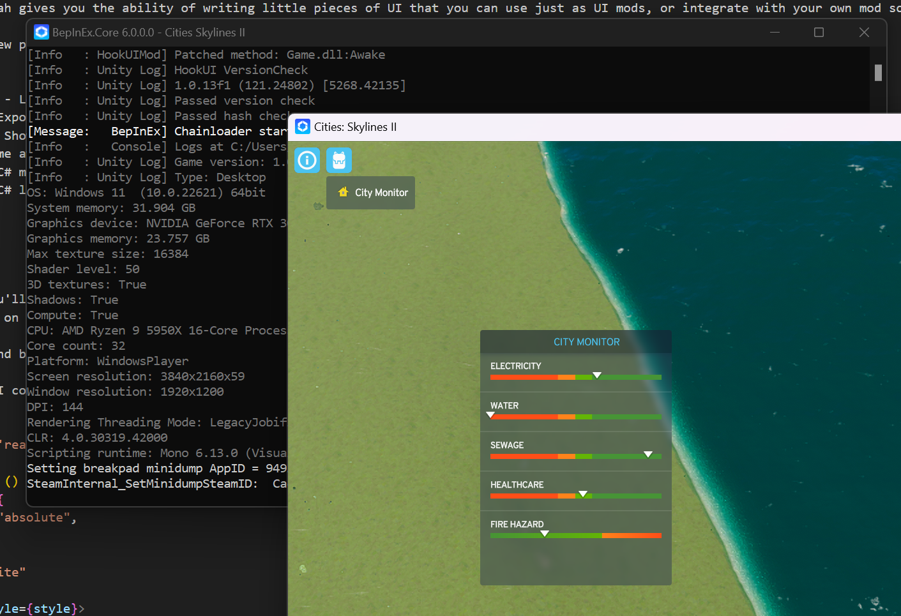

# HookUI

> Library and framework for mod authors to easily add their own mod UI, well integrated into the existing Game UI.

HookUI is some sort of UI framework/loader for Cities: Skylines 2 (C:S2). It replaces the default UI with a UI that provides hooks for mod-authors to inject their own UI components, makes it fit in  with the existing game UI easily.

> [!WARNING]  
> This is a early version of the loader/framework, expect dragons

The framework/loadah gives you the ability to write small little pieces of UI that you can use just as UI mods, or integrate with your own mod so you don't have to focus too much on UI code.

It consists of a few parts:

- C# / Game Engine 
    - HookUI Mod (`mod/`)
        - Loads files from other mods and puts them in place
        - Binds currently available extensions to a value the Game UI can read
        - Harmony patches to load the UI system and rewrite which directory the game UI uses
    - HookUI Lib (`lib/`)
        - Serves as the API for mods to register themselves, so HookUI Mod can find all the extensions required to load
- JavaScript / Game UI (`ui_lib/`)
    - API - Sets `window` properties for mods to register themselves in the UI
    - Loader - Loads the mod extensions into the correct place
    - Menu - A button in the top-left to enable/disable current panels

Put another way:

- HookUIMod - C# mod that gets loaded in Cities: Skylines 2
- HookUILib - C# Library that gets used by mod authors
- HookUI Game UI - Elements for loading and enabling/disabling extensions inside the game
- [HookUIFramework](https://github.com/Captain-Of-Coit/hookui-framework) - JavaScript library with some utilties functions for writing Game UIs for Cities: Skylines 2

# Requirements

- [Cities: Skylines 2](https://store.steampowered.com/app/949230/Cities_Skylines_II/) (duh)
- BepInEx Unity Mono [Version 5](https://github.com/BepInEx/BepInEx/releases) or [Version 6](https://builds.bepinex.dev/projects/bepinex_be)

# Manual Installation (For players)

- Make sure BepInEx is installed
- Download latest release from GitHub - [https://github.com/Captain-Of-Coit/hookui/releases](https://github.com/Captain-Of-Coit/hookui/releases)
- Extract the ZIP archive
- Place `HookUI` directory in `BepInEx\plugins` directory, within your game directory

# Documentation for Mod Authors

- [UI-Only Mods](./docs/ui-only-mods.md)
- [Embedded into existing C# Mod](./docs/csharp-embedding.md)
    - [HookUILib UI Bindings](./docs/ui-bindings.md)
- [HookUIFramework](./docs/ui-framework.md)
- [Tips & Tricks](./docs/tips.md)

# Full Examples:

- [Vehicle Counter Demonstration Mod](https://github.com/Captain-Of-Coit/cs2-vehicle-counter)
